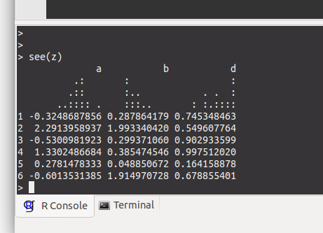

Functions to quickly see what a dataset looks like

    library(devtools)
    source_url('https://raw.githubusercontent.com/timcdlucas/see/master/R/see.R')

    z <- data.frame(a = rnorm(50), b = rexp(50), d = runif(50))

    see(z)

gives you

